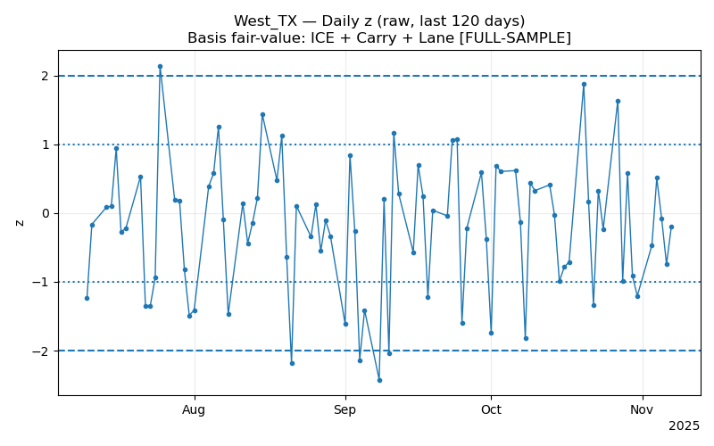
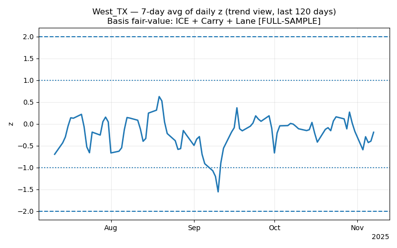

# Cotton Basis Fair Value Model

A quantitative tool for calculating the 'Fair Value' of cotton basis by analyzing the relationship between local cash prices and exchange-traded futures.

### Key Features:
* **Multivariate Regression:** Correlates three primary fundamental drivers to predict basis movement.
* **Hedging Support:** Designed to provide automated decision-support for physical commodity traders.
* **Tech Stack:** Python, NumPy, Matplotlib.

### Model Results & Signal Analysis

The model evaluates the Cotton Basis Fair Value by analyzing the deviation of current prices from the predicted fair value (Z-score). 

#### 1. Daily Z-Score (Raw Signal)
This chart represents the raw daily deviation. It is used to identify extreme market "noise" or immediate mean-reversion opportunities where the basis exceeds ±2 standard deviations.

#### 2. 7-Day Moving Average Z-Score (Trend Signal)
To filter out daily volatility and identify sustained fundamental shifts, a 7-day smoothing is applied. This "Trend View" helps in recognizing structural regimes in the West Texas basis market, providing a cleaner signal for medium-term hedging decisions.

